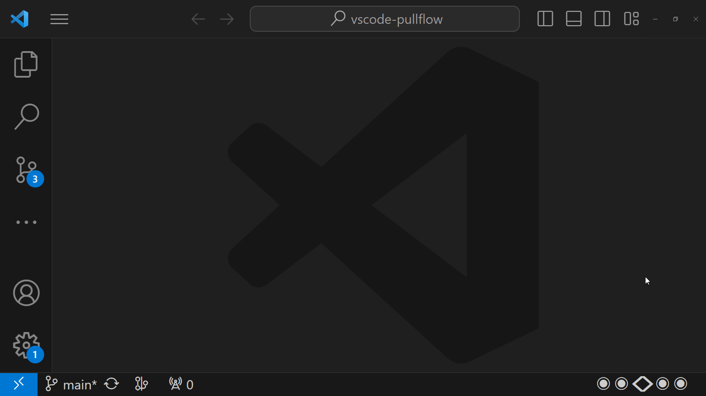
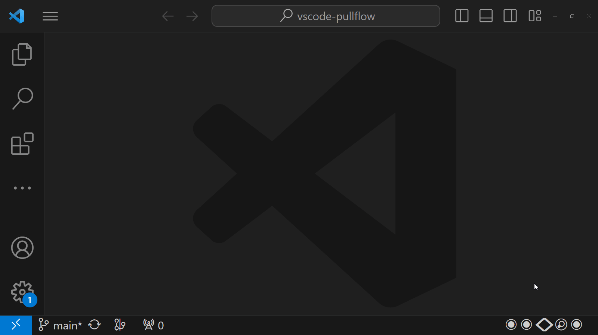
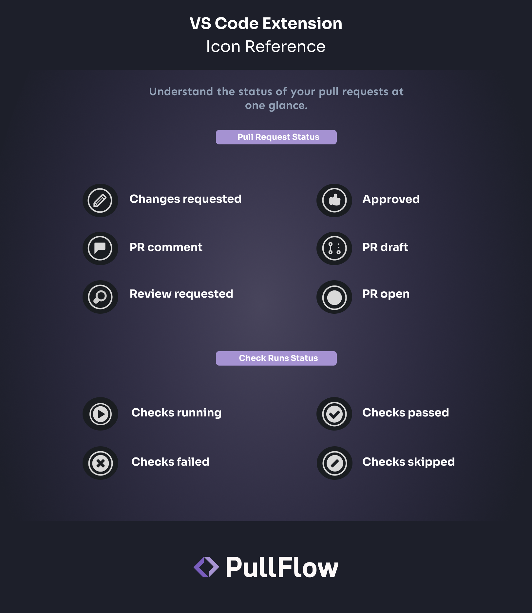

## Pullflow for VS Code

Pullflow is a code review collaboration platform backed by the co-founder of GitHub and used by some of the most innovative dev teams, including **Epic Games, Avenue, Hear.com,** and **RedwoodJS.** New to Pullflow? See how you can merge quality PRs **4X** faster with synchronized conversation between developers, systems, and AI, across GitHub, Slack & VS Code.

**[Sign up at pullflow.com](https://pullflow.com)**.

> “Love at first PR. Pullflow's beauty lies in its simplicity, which seamlessly integrates with your existing tools and streamlines the code review process. It lets me focus on writing code instead of navigating clunky interfaces.” - **Bhavin Vyas, Vice President @ WorkBoard**
>

The **Pullflow VS Code extension** brings all your code review workflows and collaboration into your IDE, helping you prioritize PRs, stay in the loop, take quick actions, and return to your flow state.


### Quick Start
---

1. **Installation**: Install the “Pullflow” extension from the Visual Studio Marketplace or Open VSX Registry.
2. **Sign in**: Click on “Sign in to Pullflow” from the VS Code status bar.
3. **Ready to use**: The extension is now ready to use ✨

## Key Features

- Unified interface in VS Code, integrating code review, management, and team communication for improved workflow efficiency.
- Quick Actions to swiftly handle code review todos, allowing for faster task completion with convenient keyboard shortcuts.
- Real-time interaction and synchronized communication between GitHub and Slack.
- Status indicators and quick access links for streamlined comprehension of PR statuses and efficient navigation to GitHub or associated Slack threads.

### **My Active Pull Requests**

**PR Dashboard**: Our extension equips VS Code with a PR Dashboard, offering a consolidated view of your active pull requests. It enables quick identification and focus on pull requests needing attention, all within VS Code Quick Pick.


### Quick Actions

The extension comes with a set of actions designed to help you take care of your code review tasks and return to your flow state. Quick actions are accessible with a quick keyboard shortcut, enabling you to:

**Pull Request Workflow Actions**

Take quick actions on pull requests, such as request review, assign, label, and approve, by clicking the status bar or using the keyboard shortcut.




**Instant GitHub/Slack Messages from VS Code**

Engage with your team by responding to comments quickly




**Perfect Companion to GitHub Pull Request and Issues Extension**

Access and review GitHub pull requests directly from your VS Code interface using the [GitHub Pull Requests and Issues](https://marketplace.visualstudio.com/items?itemName=GitHub.vscode-pull-request-github) extension. With Pullflow, all your code review activity will synchronize across GitHub and Slack.


### **Iconography**
---

The extension offers a convenient way to quickly understand the status of your Pull Requests (PRs) at a glance. It provides an overview of your pull request life cycles using icon-based indicators.



**Compatibility and Requirements**
---

The Pullflow VS Code Extension requires:

1. Pullflow account set up with Slack and GitHub connected
2. Visual Studio Code version 1.70.0 or above

## Data Security and Privacy

We utilize industry-standard encryption protocols to guarantee the confidentiality and security of your data when communicating between the extension and external platforms. You can have confidence that your discussions and interactions are safeguarded.

## Contributing

This extension is an open-source project created by [Pullflow Inc](https://github.com/pullflow/vscode-pullflow). We encourage contributions, bug reports, and new feature suggestions. Feel free to fork the repository and add your own features.

This is just the beginning of Pullflow's VS Code Slack integration, and we are eager to make improvements based on your feedback. Please don't hesitate to share your thoughts with us through [GitHub issues](https://github.com/pullflow/vscode-pullflow/issues) or on Twitter [@pullflow](https://twitter.com/pullflow).

#### **Development Guidelines**

1. Set up Pullflow account and connect your GitHub and Slack accounts.
2. Clone the repository.
3. Create `.env` file in the root directory and add the following environment variables:

```
SESSIONS_SECRET_KEY=(string) # any 32 characters key for session encryption
PULLFLOW_APP_URL="https://app.pullflow.com"
CLIENT_IDENTIFIER="com.pullflow.vscode"
```
4. Install node modules with `yarn install`.
5. Run extension with `yarn watch`.
6. Enter `cmd/ctrl+shift+D` to open debug panel and run extension in debug mode.
7. Run tests with `yarn test`.
8. Run `yarn lint` to check for linter errors.
9. Run `vsce package` to generate vsix file for extension.
10. Run `code --install-extension pullflow-{version}.vsix` to install extension locally.


## **License**

[MIT](https://github.com/pullflow/vscode-pullflow/blob/main/LICENSE)

## **Conclusion**

This tool is designed for developers seeking a unified workspace that reduces context-switching and enhances productivity by integrating codebase management, code review, and team communication into a single interface.

---

*For more information, documentation, and updates, visit **[Pullflow's official website](https://pullflow.com/)** or connect with us on **[Twitter](https://twitter.com/pullflow)**.*